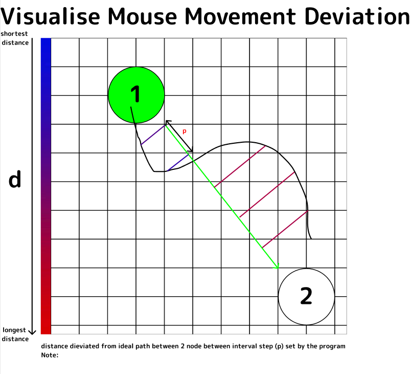

# CZ3002

CZ3002 Advanced Software Engineering

## Project Description :

The Trail Making Test is a neuropsychological test of visual attention and task switching. It consists of **two parts** in which the subject is instructed to connect a set of **25 dots** as quickly as possible while still maintaining accuracy. The test can provide information about **visual search speed, scanning, speed of processing, mental flexibility**, as well as executive functioning. It is sensitive to detecting cognitive impairment associated with dementia, for example, Alzheimer's disease.

The task requires a subject to connect a sequence of 25 **consecutive targets** on a sheet of paper or computer screen, in a similar manner to a child's **connect-the-dots** puzzle. There are two parts to the test: in the first, the targets are all numbers **(1, 2, 3, etc.)** and the test taker needs to connect them in sequential order; in the second part, the subject alternates between numbers and letters **(1, A, 2, B, etc.)**. If the **subject makes an error, the test administrator corrects them before the subject moves on to the next dot**.

## Software Tools 

1) Web Hosting - WampServer
2) IDE         - VSCode
3) Database    - AWS SQL
4) External    - Font Awesome, JQuery, Chart.js, Math.js

## Languages Used

1) Front-End   - HTML, CSS, JS
2) Back-End    - PHP, SQL

## References: 

https://en.wikipedia.org/wiki/Trail_Making_Test

## Compatiblity: 
This project only support strictly 1920x1080 resolution only, due to no scaling adjustment not done on front-end development due to time constraint and more critical issues needed more attention. 

Please also ensure you are using Google Browser Version 80.0.3987.132 (Official Build) (64-bit) or above and scale to **100% view**

# Work Process:

## Hi-FI Design : 

https://www.figma.com/file/OfzkozV5oqWFVWI32MGFVe/CoronaSG-Colors?node-id=0%3A1

## How we ensure connect-the-dots manner

### Concept:

#### Line Detection

#### Overlap Detection

### Line Detection with that serve different objectives :

####  Behind the node detection with Node's Cross Section Line

####  2 Line Segment Detection

####  Node and Line Segment Detection

####  2 Nodes Overlap Detection

### All Detection Combination and Behind The Scene Result

### Final Result

#### Test A

#### Test B

## How we measure to ensure accuracy is satisfy

### Utilize Mouse Click Event (Down and Up)

##### Total Time Taken for the Test
##### Time Taken for Test A
##### Time Taken for Test B

### Reference with Global TMT Standard

##### Average Total Time Taken for the Test
##### Average Time Taken for Test A
##### Average Time Taken for Test B

### Fairness of Test

##### 3 Attempts for all
##### Last Attempt will be recorded
##### Fixed Resolution (1920x1080) and Scaling

### Data Analysis

##### Patient History Taken

##### Patients Records

## Future Features

### [1] Enhance Data Analysis

#### Visual Analysis

Using Mouse Movement Speed to analysis severe-ness of the Dementia

Using Mouse Movement Deviation from ideal path to analysis possibility of the Dementia

## About CoronaSG:
CoronaSG aims to be your fastest solution with credibility and quality. Inaugurated in 2020, the team is built with a group of trusted young and highly motivated individuals. Even though they are young, their knowledge and experience in their field are indisputable. Their vision of creating a more cohesive and inclusive society drives them into development software like LarkDetect. LarkDetect aims to provide early detection for dementia. Dementia is not a part of normal aging. It is a condition that causes progressive intellectual decline leading to increasing difficulties in coping with everyday activities. LarkDetect would allow family and love one to plan ahead, in the event of an early detection.

## Disclaimer: 
##### Since it is a continuous development project.
##### All Information provided here subject to changes.
##### Ver 1.4